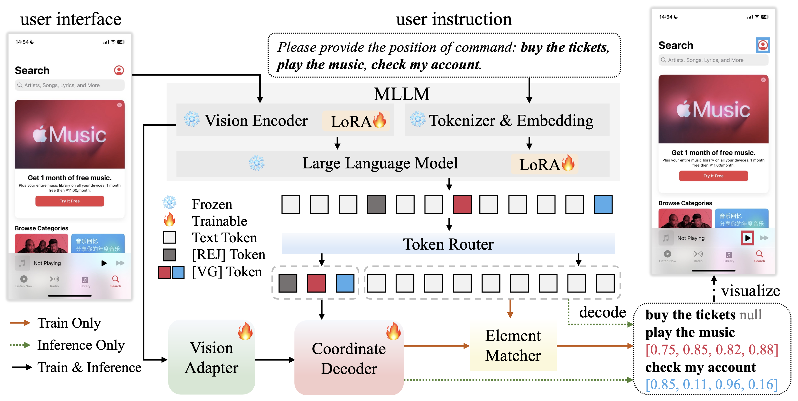

<h1 align="center">
  
  SparkUI-Parser: Enhancing GUI Perception with Robust Grounding and Parsing
</h1>

<em>The official repository of SparkUI-Parser, a novel end-to-end GUI grounding and parsing enhancement algorithm</em>

---

  
  
<em>SparkUI-Parser: Enhancing GUI Perception with Robust Grounding and Parsing</em>

---

# Overview

* [News](#news)

---

# 🎉 News

[2025-9-5] **We relearse our paper: SparkUI-Parser: Enhancing GUI Perception with Robust Grounding and Parsing. We plan to open source the training code and our proposed GUI parsing benchmark-ScreenParse with evaluation code soon.**