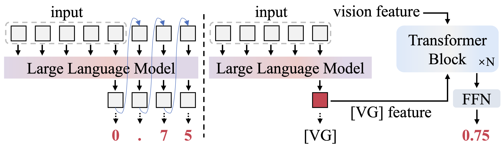

<h1 align="center">
  
  SparkUI-Parser: Enhancing GUI Perception with Robust Grounding and Parsing
</h1>

<div align="center">

<p><em>The official repository of SparkUI-Parser, a novel end-to-end GUI grounding and parsing enhancement algorithm</em></p>

[](https://arxiv.org/abs/2509.04908)
[](https://www.alphaxiv.org/abs/2509.04908)
[](https://github.com/antgroup/SparkUI-Parser)
<!-- []() -->
</div>

---

<div align="center">
  
  <p><em>SparkUI-Parser: Enhancing GUI Perception with Robust Grounding and Parsing</em></p>
</div>

---

# Overview

* [News](#news)
* [Motivation](#motivation)
* [Highlights](#highlights)
* [Citation](#citation)

---

# 🎉 News

[2025-9-5] **We relearse our paper: SparkUI-Parser: Enhancing GUI Perception with Robust Grounding and Parsing. We plan to open source the training code and our proposed GUI parsing benchmark-ScreenParse with evaluation code soon.**

---

# 🚀 Motivation

<div align="center">
  
  <p><em>Comparison of the coordinate generation between prior methods (left) and ours (right).</em></p>
</div>

We utilize enhanced features instead of multiple discrete tokens to obtain continuous coordinate values, thereby improving the precision of grounding and speeding up the inference.

---

# ✨ Highlights

* 🎯 **Robust Grounding and Parsing**: We are the first to introduce an end-to-end MLLM for GUI perception, which simultaneously achieves robust grounding and parsing on user interfaces, providing a comprehensive perception of semantics and structures.
* 🔀 **Route-then-predict Framework**: By processing semantics and coordinates of the element separately, our method improves precision in grounding by around 3% averagely and speeds up grounding and parsing by 5 times and 4 times in average.
* 📊 **Parsing Benchmark-ScreenParse**: a benchmark for GUI parsing, which provides an evaluation for the performance of models in both locating specific elements and perceiving the overall structure of user interfaces.
* 👑 **Excellent Grounding and Parsing Performance** on various benchmarks.

---

# 📄 Citation

If you use works related to **SparkUI-Parser**, please cite our work:

```bibtex
@misc{jing2025sparkuiparserenhancingguiperception,
      title={SparkUI-Parser: Enhancing GUI Perception with Robust Grounding and Parsing}, 
      author={Hongyi Jing and Jiafu Chen and Chen Rao and Ziqiang Dang and Jiajie Teng and Tianyi Chu and Juncheng Mo and Shuo Fang and Huaizhong Lin and Rui Lv and Chenguang Ma and Lei Zhao},
      year={2025},
      eprint={2509.04908},
      archivePrefix={arXiv},
      primaryClass={cs.AI},
      url={https://arxiv.org/abs/2509.04908}, 
}
```
If you are interested in our method or it helps your research, please give us a star 🌟 on GitHub.